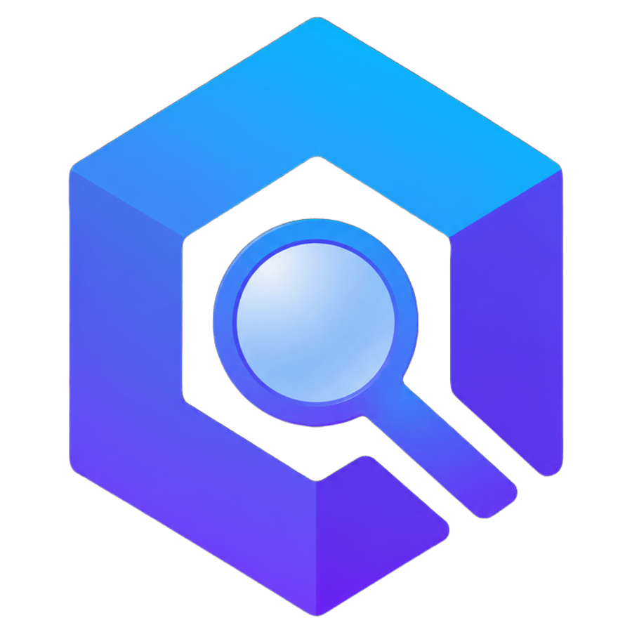

<h1 align="center">
  
  Parikshan
</h1>
<p align="center">End-to-End testing framework for Compose Multiplatform</p>
<p align="center">
  <a href="https://github.com/aryapreetam/parikshan/actions/workflows/release.yml">
    
  </a>
  <a href="https://mvnrepository.com/artifact/io.github.aryapreetam/parikshan">
    
  </a>
</p>

### Features

- Write one test in Kotlin, run it on Android, iOS, Desktop, and Web (Wasm).
- No test related dependencies OR code in the main app.
- Built-in screenshot capture and video recording (including headless CI).

[**📖 API Reference**](https://aryapreetam.github.io/parikshan/api/)

---

## 🛠️ Quick Start

### 1. Apply the Plugin
In your **shared library** (e.g., `:composeApp`) `build.gradle.kts`:

```kotlin
plugins {
  id("io.github.aryapreetam.parikshan") version "0.0.2"
}
```

### 2. Write your first test
Create a test in `src/commonTest/kotlin`:

```kotlin
class MyE2ETest {
  @Test
  fun testLoginFlow() = e2eTest {
    inputText("username_field", "admin")
    click("login_button")
    assertVisible("dashboard_screen")
    screenshot("login-success")
  }
}
```

### 3. Run on any platform
```bash
./gradlew e2eAndroidTest
./gradlew e2eIosTest
./gradlew e2eDesktopTest
./gradlew e2eWasmTest

# OR many at once concurrently

./gradlew e2eTest --targets=android,desktop,wasm
```

---

## 📦 Examples

See the [sample project tests](https://github.com/aryapreetam/parikshan/tree/main/sample/composeApp/src/commonTest/kotlin/sample/app) for working examples of how to write E2E tests using the Parikshan DSL.

---

## License

MIT License © 2026 aryapreetam. See [LICENSE](./LICENSE) for details.
