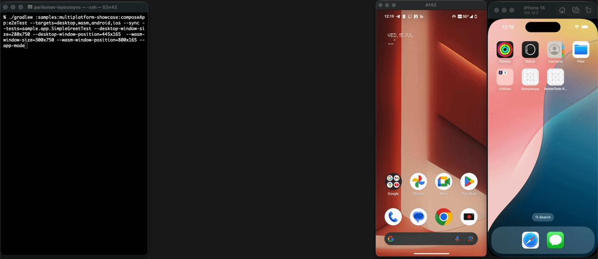

<h1 align="center">
  
  Parikshan
</h1>
<p align="center">End-to-End testing framework for Compose Multiplatform</p>
<p align="center">
  <a href="https://github.com/aryapreetam/parikshan/actions/workflows/release.yml">
    
  </a>
  <a href="https://mvnrepository.com/artifact/io.github.aryapreetam/parikshan">
    
  </a>
  <a href="https://github.com/aryapreetam/parikshan/actions/workflows/push-ci.yml">
    
  </a>
  <a href="https://kotlinlang.org/docs/components-stability.html">
    
  </a>
</p>

<p align="center">
  
</p>

### Features

- Write test in Kotlin, run it on Android, iOS, Desktop, and Web (Wasm).
- No test related dependencies OR code in the main app.
- Built-in screenshot capture and video recording (including headless CI).

[**📖 API Reference**](https://aryapreetam.github.io/parikshan/api/)

---

## 🛠️ Quick Start

### 1. Apply the Plugin
In your **shared library** (e.g., `:composeApp`) `build.gradle.kts`:

```kotlin
plugins {
  id("io.github.aryapreetam.parikshan") version "0.0.5"
}
```

### 2. Write your first test
Create a test in `src/commonTest/kotlin`:

```kotlin
package sample.app

import io.github.aryapreetam.parikshan.e2eTest
import kotlin.test.Test

class SimpleGreetTest {
  @Test
  fun testSimpleGreeting() = e2eTest {
    // Enter name
    input("name_input", "परिक्षण")
    
    // Click Greet button
    click("greet_button")
    
    // Check if greeting is displayed
    assertVisible("Hello, परिक्षण!")
  }
}
```

### 3. Run on any platform
```bash
./gradlew e2eAndroidTest
./gradlew e2eIosTest
./gradlew e2eDesktopTest
./gradlew e2eWasmTest

# OR many at once concurrently

./gradlew e2eTest --targets=android,desktop,wasm
```

---

## 📦 Examples

See the [Examples Page](examples.md) for working samples and video demonstrations of the Parikshan DSL across all target platforms.

---

## License

MIT License © 2026 aryapreetam. See [LICENSE](./LICENSE) for details.
