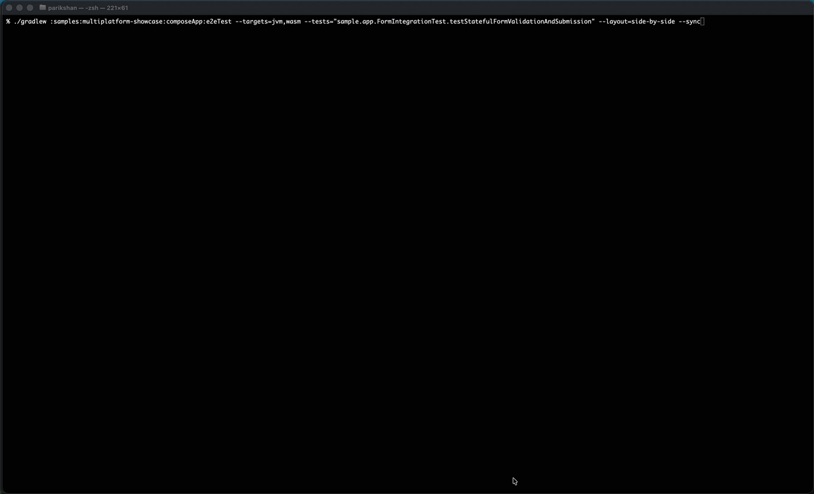
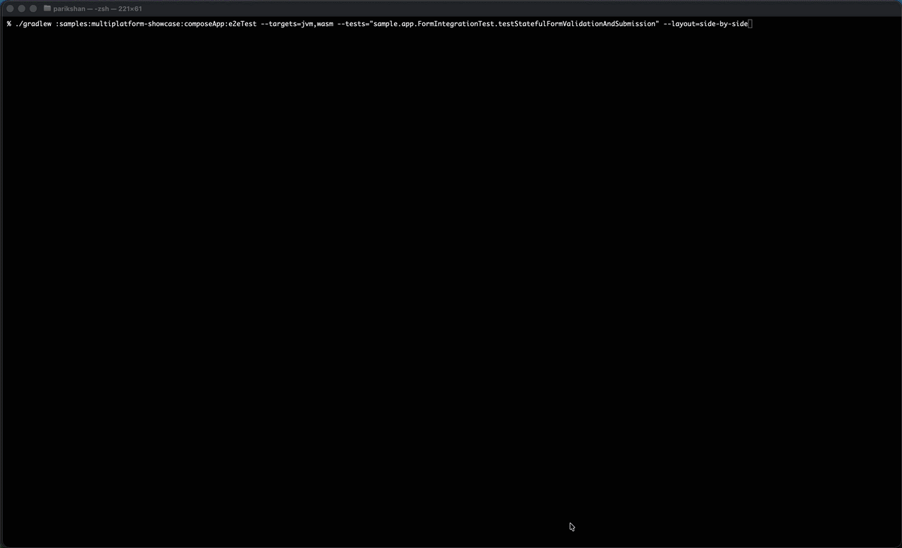
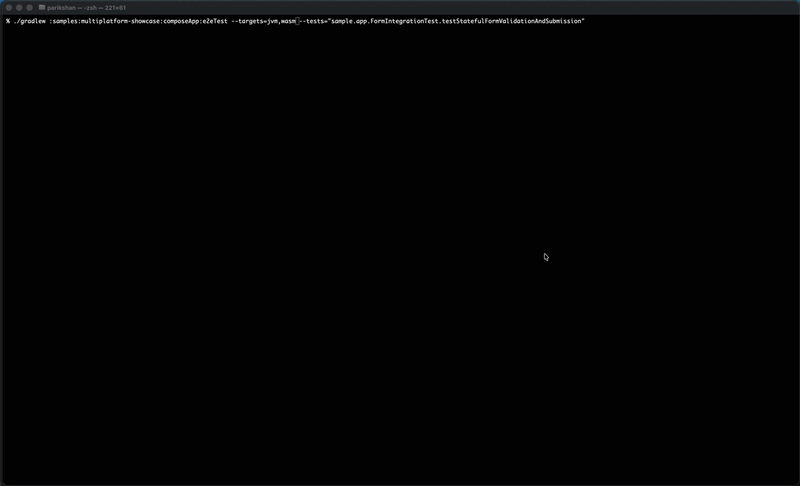
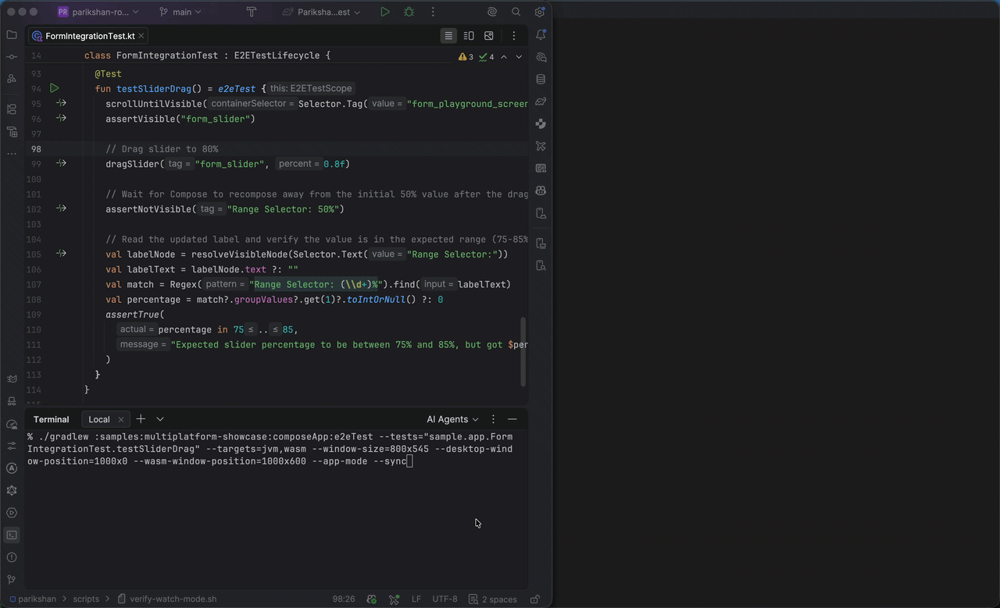

# CLI Options & Configuration

Parikshan supports execution configuration through Gradle command-line flags on the `e2eTest` task, convenience short-form arguments, and system properties (`-Dparikshan.*`).

---

## Configuration Models

* **Unified `e2eTest` Task (Recommended for multi-target workflows):**
  Accepts task command-line options (`--<option>`):
  ```bash
  ./gradlew e2eTest --video --targets=desktop,wasm --layout=side-by-side
  ```
* **Target-Specific Tasks (`e2eDesktopTest`, `e2eWasmTest`, `e2eAndroidTest`, `e2eIosTest`):**
  Standard Gradle `Test` tasks that accept JVM system properties and Gradle properties:
  ```bash
  ./gradlew e2eDesktopTest -Dparikshan.video.enabled=true
  ```

---

## Task Command-Line Flags Reference

| Option / Flag | Type | Default | Description | Preferred Syntax (`e2eTest`) | Target Task Property |
| :--- | :--- | :--- | :--- | :--- | :--- |
| `--targets` | String | Configured targets | Comma-separated list of targets (`desktop`, `wasm`, `android`, `ios`) | `--targets=desktop,wasm` | N/A |
| `--tests` | String | All tests | Class or method filter pattern | `--tests="sample.app.LoginTest"` | `--tests="..."` |
| `--video` | Flag | `false` | Enables MP4 video recording per test execution (not supported with `--sync` or `--watch`) | `--video` | `-Dparikshan.video.enabled=true` |
| `--granularity` | String | `class` | Video recording granularity (`session`, `run`, `class`, `test`) | `--granularity=session` | `-Dparikshan.video.granularity=...` |
| `--post-roll-ms` | String | `1000` | Post-roll pause duration in milliseconds before stopping recording | `--post-roll-ms=2000` | `-Dparikshan.video.postRollMs=...` |
| `--step-delay-ms` | String | `0` | Delay in milliseconds inserted after each UI command during test execution | `--step-delay-ms=250` | `-Dparikshan.stepDelayMs=...` |
| `--background` | Flag | `false` | Runs tests in headless / background mode | `--background` | `-Dparikshan.background=true` |
| `--layout` | String | `default` | Layout presentation mode: `default` or `side-by-side` | `--layout=side-by-side` | N/A |
| `--window-size` | String | Target default | Global window geometry applied uniformly to Desktop and Wasm | `--window-size=360x720` | `-Dparikshan.desktop.width=...` |
| `--desktop-window-size` | String | Auto | Desktop-specific window dimensions (`<width>x<height>`) | `--desktop-window-size=400x800` | `-Dparikshan.desktop.width=...` |
| `--desktop-window-position` | String | Auto | Desktop-specific screen coordinates (`<x>,<y>` or `<x>x<y>`) | `--desktop-window-position=10,50` | N/A |
| `--wasm-window-size` | String | Auto | Wasm browser window dimensions (`<width>x<height>`) | `--wasm-window-size=400x800` | `-Dparikshan.wasm.viewport.width=...` |
| `--wasm-window-position` | String | Auto | Wasm browser screen coordinates (`<x>,<y>` or `<x>x<y>`) | `--wasm-window-position=420,50` | N/A |
| `--app-mode` | Boolean | `false` | Launches Web/Wasm in a standalone window (hiding browser navigation toolbar) | `--app-mode` | `-Dparikshan.wasm.appMode=true` |
| `--keep-alive` | Boolean | `false` | Keeps target applications running after tests finish for fast subsequent runs | `--keep-alive` | `-Dparikshan.keepAlive=true` |
| `--watch` | Boolean | `false` | Continuous file watcher daemon re-executing tests on save | `--watch` | N/A |
| `--compile-command` | String | Auto | Shell command used for recompilation in watch mode | `--compile-command="./gradlew assemble"` | N/A |
| `--sync` | Boolean | `false` | Executes tests across all targets in synchronized lockstep mode | `--sync` | N/A |
| `--reclaim-ports` | Boolean | `false` | Terminates conflicting processes holding communication ports | `--reclaim-ports` | `-Dparikshan.reclaimPorts=true` |
| `--device` | String | Auto | Target device name, adb serial, or iOS simulator name | `--device="iPhone 16"` | `-Pparikshan.device="..."` |
| `--android-device` | String | Auto | Android device or emulator serial override | `--android-device="emulator-5554"` | `-Pparikshan.android.serial="..."` |
| `--ios-device` | String | Auto | iOS simulator name or UDID override | `--ios-device="iPhone 16"` | `-Pparikshan.ios.device="..."` |

---

## Layout, Size & Position Control

Parikshan allows configuring window geometry and desktop placements for Desktop and Web (Wasm) targets.

### Side-by-Side Layout
`--layout=side-by-side` positions Desktop and Wasm windows adjacent to each other on your screen:

=== "Side-by-Side with Sync"
    ```bash
    ./gradlew :samples:multiplatform-showcase:composeApp:e2eTest \
      --targets=jvm,wasm \
      --tests="sample.app.FormIntegrationTest.testStatefulFormValidationAndSubmission" \
      --layout=side-by-side \
      --sync
    ```

    

=== "Side-by-Side without Sync"
    ```bash
    ./gradlew :samples:multiplatform-showcase:composeApp:e2eTest \
      --targets=jvm,wasm \
      --tests="sample.app.FormIntegrationTest.testStatefulFormValidationAndSubmission" \
      --layout=side-by-side
    ```

    

=== "Default Placement (Without Side-by-Side)"
    ```bash
    ./gradlew :samples:multiplatform-showcase:composeApp:e2eTest \
      --targets=jvm,wasm \
      --tests="sample.app.FormIntegrationTest.testStatefulFormValidationAndSubmission"
    ```

    

### Standalone Window Mode for Web (`--app-mode`)
By default, Web (Wasm) launches inside a standard browser window with navigation bars. Adding `--app-mode` launches Chromium as a standalone application, stripping the URL address bar, tabs, and navigation chrome for a clean application viewport:

```bash
# Standard browser window (default)
./gradlew :samples:multiplatform-showcase:composeApp:e2eTest --targets=wasm --tests="sample.app.HomeScreenTest"

# Standalone app window (removes address bar and tabs)
./gradlew :samples:multiplatform-showcase:composeApp:e2eTest --targets=wasm --tests="sample.app.HomeScreenTest" --app-mode
```

<table class="demo-table">
  <thead>
    <tr>
      <th width="50%">Standard Browser Window (Default)</th>
      <th width="50%">Standalone App Window (<code>--app-mode</code>)</th>
    </tr>
  </thead>
  <tbody>
    <tr>
      <td>
        
        <p style="font-size: 0.85em; margin-top: 0.5rem; opacity: 0.85;">Standard Chromium window with URL address bar, tab strip, and navigation controls.</p>
      </td>
      <td>
        
        <p style="font-size: 0.85em; margin-top: 0.5rem; opacity: 0.85;">Adding <code>--app-mode</code> removes the address bar and tabs, launching the application in a clean, focused window.</p>
      </td>
    </tr>
  </tbody>
</table>

### Window Dimensions & Positioning
* `--window-size=<width>x<height>` sets dimensions applied uniformly to both Desktop and Wasm targets.
* Target-specific options (`--desktop-window-size`, `--desktop-window-position`, `--wasm-window-size`, `--wasm-window-position`) override global settings:

```bash
# Uniform dimension across Desktop and Wasm
./gradlew e2eTest --targets=desktop,wasm --window-size=360x720

# Target-specific dimensions, explicit screen coordinates, and standalone app mode with sync
./gradlew :samples:multiplatform-showcase:composeApp:e2eTest \
  --tests="sample.app.FormIntegrationTest.testSliderDrag" \
  --targets=jvm,wasm \
  --window-size=800x545 \
  --desktop-window-position=1000x0 \
  --wasm-window-position=1000x600 \
  --app-mode \
  --sync
```



---

## Synchronized Multi-Target Execution (`--sync`)

In synchronized mode, Parikshan drives all specified targets concurrently using a step-barrier model. Every command is dispatched to all target drivers in parallel, and the test runner waits for all targets to finish before advancing to the next step.

=== "Synchronized Lockstep (`--sync`)"
    ```bash
    ./gradlew :samples:multiplatform-showcase:composeApp:e2eTest \
      --targets=jvm,wasm \
      --tests="sample.app.FormIntegrationTest.testStatefulFormValidationAndSubmission" \
      --layout=side-by-side \
      --sync
    ```

    

=== "Asynchronous Execution (Default)"
    ```bash
    ./gradlew :samples:multiplatform-showcase:composeApp:e2eTest \
      --targets=jvm,wasm \
      --tests="sample.app.FormIntegrationTest.testStatefulFormValidationAndSubmission" \
      --layout=side-by-side
    ```

    

!!! note
    Video recording is currently not supported during synchronized multi-target (`--sync`) execution. Video recording remains fully supported for standard multi-target runs (`e2eTest --targets=desktop,wasm`) and individual target tasks.

!!! tip "Target Scoping"
    Synchronized mode is designed for focused cross-platform verification during development. Run `--sync` against a single test scenario:

    ```bash
    ./gradlew e2eTest --targets=desktop,wasm,android,ios --sync --tests="sample.app.LoginTest"
    ```

---

## Continuous Watch Mode (`--watch`)

Watch mode monitors project source files and re-executes tests automatically when changes are saved, keeping application instances alive across runs.

```bash
./gradlew :samples:multiplatform-showcase:composeApp:e2eTest \
  --targets=jvm,wasm \
  --tests="sample.app.AccessibilityIntegrationTest.testSubtextMatching" \
  --desktop-window-position=1070x0 \
  --app-mode \
  --layout=side-by-side \
  --window-size=360x720 \
  --watch
```

<video controls autoplay loop muted playsinline onloadedmetadata="this.playbackRate = 2.0;" style="width: 100%; border-radius: 6px; margin: 1rem 0;">
  <source src="../../assets/watch-mode.mp4" type="video/mp4" />
</video>

### How Watch Mode Works (TDD Cycle)
The video demonstrates the continuous feedback loop:

1. **Initial Run (Pass):** Parikshan boots the target applications, docks them according to layout flags (e.g. side-by-side in `--app-mode`), and executes the baseline test pass. Application windows remain active.
2. **Code Edit (Fail):** Changing source or test code (e.g. updating an assertion or UI component) triggers an automatic background compile upon saving. Tests re-execute immediately without relaunching applications, showing failure feedback in the terminal.
3. **Correction (Pass):** Restoring or fixing the code and saving triggers an instant re-run (~1–2 seconds), turning the suite green.

### Termination & Multi-Target Sync
* **Exiting Watch Mode:** Terminate watch mode at any time using `Ctrl + C` in your terminal, or by manually closing any running application window (Desktop or browser window). Parikshan detects window closure and terminates the daemon cleanly.
* **Synchronized Watch (`--sync --watch`):** When `--sync` is combined with `--watch`, all targets run in step-barrier lockstep on every re-trigger, waiting for each command to complete across all platforms before advancing.

!!! note
    Video recording is not supported in continuous watch mode (`--watch`).

!!! tip "Target Scoping"
    Use watch mode for rapid TDD iterations targeting a single test scenario:

    ```bash
    ./gradlew e2eTest --targets=desktop --watch --tests="sample.app.LoginTest"
    ```

### Behavior & Mechanics
* **Automatic Session Preservation:** `--watch` automatically enables `--keep-alive` internally so application instances remain open across test runs.
* **Debounced Monitoring:** Prevents multiple test executions on rapid file saves.
* **Compiler Error Resilience:** If a code change causes compilation errors, watch mode displays the compiler output and waits for the next edit without terminating.
* **Clean Termination:** Closing any application window exits watch mode cleanly.

### Automated Verification Script
To verify or automate continuous watch runs in a local shell or CI sandbox, run [`scripts/verify-watch-mode.sh`](https://github.com/aryapreetam/parikshan/blob/main/scripts/verify-watch-mode.sh):

```bash
./scripts/verify-watch-mode.sh
```

---

## Synchronized Watch Mode (`--sync --watch`)

Combine `--sync`, `--watch`, and layout options for live, multi-platform feedback while editing code or tests:

```bash
./gradlew e2eTest \
  --targets=desktop,wasm \
  --sync \
  --watch \
  --layout=side-by-side \
  --app-mode \
  --tests="sample.app.LoginTest"
```

To run automated verification for synchronized watch mode:

```bash
./scripts/verify-watch-mode.sh --sync
```

---

## Fast Manual Iterations (`--keep-alive`)

`--keep-alive` is a standalone option for single-shot test runs that leaves the target application running after tests complete:

```bash
./gradlew e2eTest --targets=desktop --keep-alive --tests="sample.app.LoginTest"
```

* **How it works:** Parikshan saves active session metadata (ports and tokens) to `build/parikshan/active-session.json`. On subsequent manual executions, Parikshan reuses the active running application, bypassing build and startup overhead for ~1–2 second re-runs.
* **Difference from `--watch`:** `--keep-alive` executes once and waits for manual re-execution (via IDE run configurations or terminal shortcuts), whereas `--watch` continuously monitors files and re-runs tests automatically. Passing `--watch` automatically enables `--keep-alive`.

---

## Device & Simulator Selection

Parikshan manages device connections and simulator lifecycles automatically:

```bash
# Target Android device by adb serial
./gradlew e2eTest --targets=android --android-device="emulator-5554"

# Target iOS simulator by name or UDID
./gradlew e2eTest --targets=ios --ios-device="iPhone 16 Pro"

# Unified device selector
./gradlew e2eTest --targets=android,ios --device="emulator-5554"
```

### Auto-Booting & Host Platform Behavior
* **Automatic iOS Simulator Booting:** When targeting iOS on macOS, if the requested or default simulator is powered off, Parikshan boots it (`xcrun simctl boot`), opens the Simulator window (`open -a Simulator`), installs the application, and connects.
* **Single Device Discovery:** If exactly one Android device or emulator is connected, Parikshan selects it automatically. If multiple devices are connected, Parikshan prompts for disambiguation via `--android-device=<serial>` or `--device=<serial>`.
* **Cross-Platform Host Safety:** On non-macOS hosts (Linux/Windows) or Intel Mac architectures, iOS test execution is skipped with a lifecycle message, allowing remaining targets (Desktop, Wasm, Android) to proceed.

---

## System Properties (`-Dparikshan.*`)

System properties configure low-level runtime behavior and video recording parameters across all tasks:

### Execution & Timing Options

| System Property | Type | Default | Description |
| :--- | :--- | :--- | :--- |
| `parikshan.stepDelayMs` | Long | `0` | Delay in milliseconds inserted after each UI command across all targets (`0..5000` ms) |

### Video Recording Options

| System Property | Type | Default | Description |
| :--- | :--- | :--- | :--- |
| `parikshan.video.enabled` | Boolean | `false` | Enables MP4 video recording per test execution |
| `parikshan.video.outputDir` | String | `build/parikshan/videos` | Target directory where generated MP4 videos are saved |
| `parikshan.video.fps` | Int | `10` | Frame rate for encoded video capture (`1..30`) |
| `parikshan.video.showCursor` | Boolean | `true` | Renders a virtual cursor overlay in recorded videos |
| `parikshan.video.granularity` | String | `class` | Recording lifecycle scope: `session`/`run` (one video for entire run), `class` (one per test class), or `test` (one per method) |
| `parikshan.video.postRollMs` | Long | `1000` | Post-roll pause duration before closing video capture (`0..10000` ms) |
| `parikshan.video.width` | Int | Auto | Target video frame width in pixels (`100..3840`) |
| `parikshan.video.height` | Int | Auto | Target video frame height in pixels (`100..2160`) |
| `parikshan.video.deviceScaleFactor` | Double | Auto | Optional device scale factor/DPR (`0.0..4.0`) |