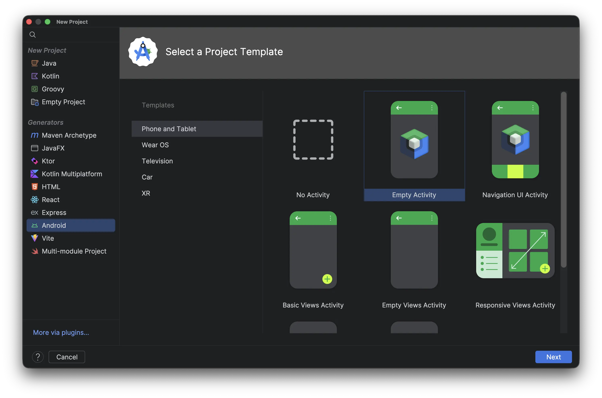
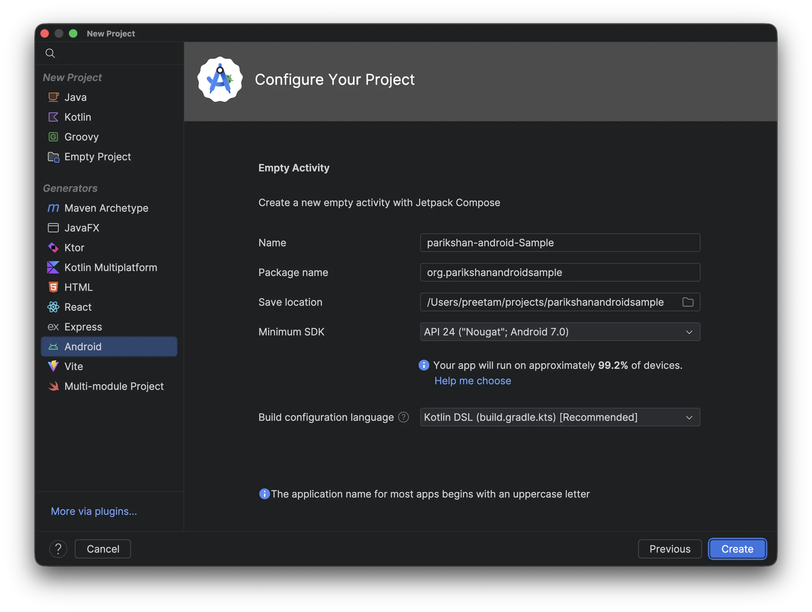
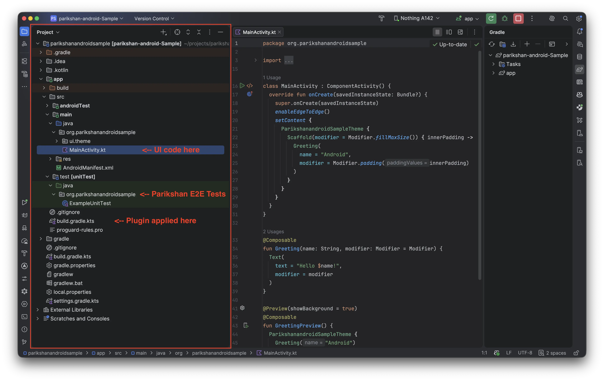
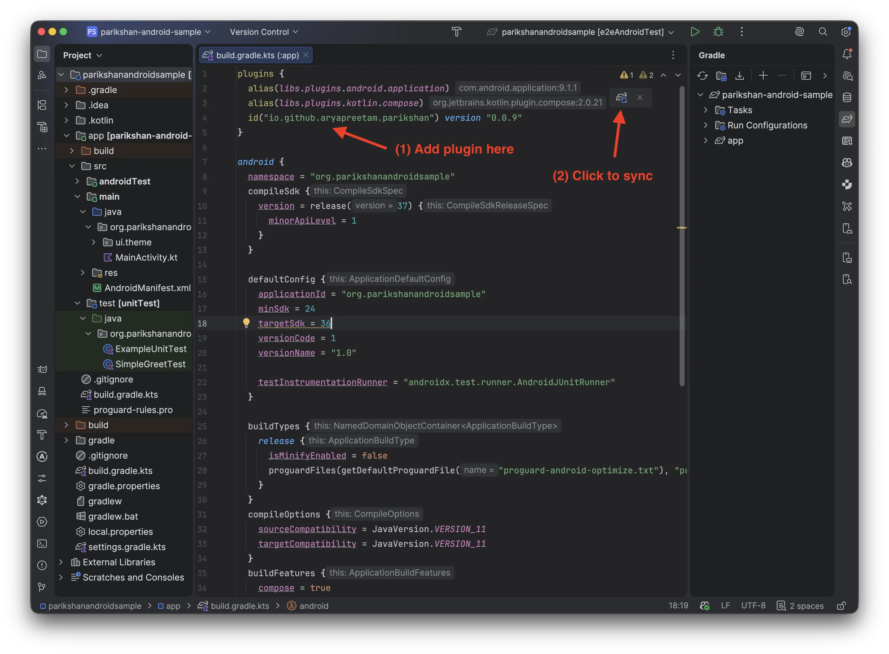
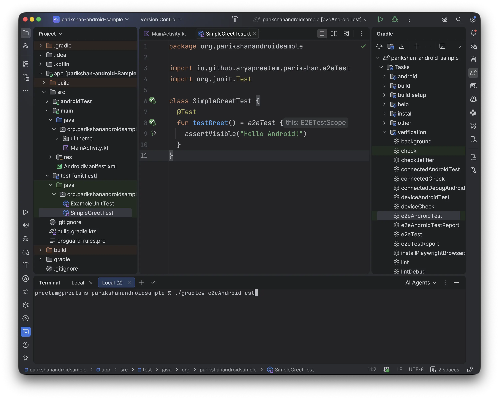

# Your First Test (Standalone Android)

This step-by-step guide walks through configuring and running your first automated E2E test in a standalone Android Jetpack Compose project (without Kotlin Multiplatform) with **zero modifications to your UI code**.

> **Building a Compose Multiplatform (KMP) app instead?** See [Your First KMP Test](your-first-test.md).  
> **Prefer cloning a working project?** Clone the starter template: [github.com/aryapreetam/parikshan-android-sample](https://github.com/aryapreetam/parikshan-android-sample)  
> *(Or explore the in-repo [standalone-android sample](../examples.md#4-standalone-android)).*

---

## 0. Prerequisites

Ensure your environment meets the following requirements:

* **Android Studio:** Android Studio Ladybug (2024.2+) or newer.
* **JDK:** Version 21 or newer (`java -version`).
* **Android Device / Emulator:** API Level 24+ running with ADB debugging enabled (`adb devices`).

---

## 1. Create or Open an Android Project

Create a new Android project in Android Studio using the standard **Empty Activity** template (Jetpack Compose).



### Project Configuration Settings

1. **Name:** `parikshanandroidsample`
2. **Package name:** `org.parikshanandroidsample`
3. **Build configuration language:** `Kotlin DSL (build.gradle.kts)`
4. **Minimum SDK:** `API 24 ("Nougat"; Android 7.0)` or higher



### Directory Structure

In a single-module Android project, your source files and tests reside under `:app`:

```text
parikshanandroidsample/
├── app/
│   ├── src/
│   │   ├── main/java/org/parikshanandroidsample/
│   │   │   └── MainActivity.kt                    <-- Your Composable UI
│   │   └── test/java/org/parikshanandroidsample/
│   │       └── SimpleGreetTest.kt                 <-- Your Parikshan E2E Test
│   └── build.gradle.kts                           <-- Plugin applied here
├── gradle/
├── build.gradle.kts
├── settings.gradle.kts
└── gradle.properties
```

<div class="step-comparison step-ide-phone" markdown="1">
<div class="step-images-row" markdown="1">
<div class="step-before" markdown="1">



</div>
<div class="step-arrow">&rarr;</div>
<div class="step-after">
  
</div>
</div>
<div class="step-captions-row">
<div class="caption-before"><em>1. Android project layout in IDE</em></div>
<div class="caption-arrow"></div>
<div class="caption-after"><em>2. Default Greeting app running on device/emulator</em></div>
</div>
</div>

---

## 2. Apply the Parikshan Plugin

Open `app/build.gradle.kts` and apply the Parikshan plugin inside `plugins { ... }`:

```kotlin
plugins {
    alias(libs.plugins.android.application)
    alias(libs.plugins.kotlin.compose)
    id("io.github.aryapreetam.parikshan") version "0.0.9" // (1)
}
```

1. Applies the Parikshan Gradle plugin. This automatically registers test dependencies and sets up the `:app:e2eAndroidTest` and `:app:e2eTest` tasks.

Click **Sync Now** in the top-right notification banner of Android Studio.

Once synced, open the **Gradle** tool window on the right side under `app > Tasks > verification` to see `e2eAndroidTest` registered:

<div class="step-comparison step-ide-phone" markdown="1">
<div class="step-images-row" markdown="1">
<div class="step-before" markdown="1">



</div>
<div class="step-arrow">&rarr;</div>
<div class="step-after">
  
</div>
</div>
<div class="step-captions-row">
<div class="caption-before"><em>1. Add plugin to <code>app/build.gradle.kts</code> and click Sync</em></div>
<div class="caption-arrow"></div>
<div class="caption-after"><em>2. <code>e2eAndroidTest</code> task registered under <code>verification</code></em></div>
</div>
</div>

---

## 3. Write Your E2E Test

With Parikshan, you do not need to modify your existing UI code or add custom test tags to get started. You can target text elements and accessibility semantics directly.

Create a new test class inside `app/src/test/java/org/parikshanandroidsample/SimpleGreetTest.kt`:

```kotlin
package org.parikshanandroidsample

import io.github.aryapreetam.parikshan.e2eTest
import org.junit.Test

class SimpleGreetTest {
  @Test
  fun testGreet() = e2eTest {
    assertVisible("Hello Android!") // (1)
  }
}
```

1. **`assertVisible("Hello Android!")`**: Asserts that the greeting text rendered by `MainActivity.kt` appears in the UI semantics tree.



!!! caution "Do Not Run Tests via IDE Gutter Icons"
    Running tests directly via the green gutter play icon (▶) next to `@Test` or class declarations in Android Studio is not currently supported for Parikshan host-driven tests. Gutter icon execution will be enabled once the dedicated Parikshan IDE plugin is released.

    

    **Recommended execution methods:**
    
    * **From Terminal (Recommended):** Run `./gradlew :app:e2eAndroidTest` (offers full CLI options, filters, and device flags).
    * **From Gradle Tool Window:** Open the **Gradle** tool window on the right, navigate to `app > Tasks > verification`, and double-click **`e2eAndroidTest`**.

---

## 4. Execute on Android Emulator or Device

### 1. Ensure an Emulator or Device is Running

Verify your device or emulator is connected via ADB:

```bash
adb devices
```

Output:
```text
List of devices attached
emulator-5554   device
```

### 2. Run the Test Task

Execute the test from your terminal:

```bash
./gradlew :app:e2eAndroidTest
```

*(Alternatively, `./gradlew :app:e2eTest` automatically executes against the Android target).*

```text
> Task :app:e2eAndroidTest
Parikshan Android: running E2E test classes org.parikshanandroidsample.SimpleGreetTest
org.parikshanandroidsample.SimpleGreetTest > testGreet PASSED

BUILD SUCCESSFUL in 5s
```

#### Visual Verification: Android Test Execution

<video autoplay loop muted playsinline controls style="width: 100%; border-radius: 8px; border: 1px solid rgba(128, 128, 128, 0.2); margin: 1em 0;">
  <source src="../../assets/guides/first-test-android/android-test-run.mp4" type="video/mp4" />
</video>

!!! tip "Terminal Customization Options"
    Running tests from the terminal provides powerful CLI options for both `e2eAndroidTest` and the unified `e2eTest` task:
    
    === "Target-Specific (`e2eAndroidTest`)"

        * **Run a specific test class:**
          ```bash
          ./gradlew :app:e2eAndroidTest --tests "org.parikshanandroidsample.SimpleGreetTest"
          ```
        * **Target a specific device or emulator serial:**
          ```bash
          ./gradlew :app:e2eAndroidTest -Pdevice=emulator-5554
          ```
        * **Enable automatic MP4 video recording:**
          ```bash
          ./gradlew :app:e2eAndroidTest -Dparikshan.video.enabled=true
          ```

    === "Unified Task (`e2eTest`)"

        * **Run against Android with test filtering:**
          ```bash
          ./gradlew :app:e2eTest --targets=android --tests "org.parikshanandroidsample.SimpleGreetTest"
          ```
        * **Target a specific device serial:**
          ```bash
          ./gradlew :app:e2eTest --targets=android --device="emulator-5554"
          ```
        * **Enable video recording:**
          ```bash
          ./gradlew :app:e2eTest --video --targets=android
          ```

---

??? note "Troubleshooting & Common Gotchas"

    ### 1. `DeviceNotFoundException` or "No connected devices"
    * **Cause:** No active Android emulator or physical device is detected by ADB.
    * **Fix:** Open Android Studio Device Manager and start an Android Virtual Device (AVD). Confirm with `adb devices`.

    ### 2. Element Not Found / Timeout
    * **Cause:** The text passed to `assertVisible()` does not match the text displayed on screen.
    * **Fix:** Double-check text casing, punctuation, and dynamic string values (e.g. `"Hello Android!"`).

    ### 3. Screen Locked / Device Asleep
    * **Cause:** The emulator or device screen is asleep or locked when tests run.
    * **Fix:** Wake and unlock the device before running tests:
      ```bash
      adb shell input keyevent 82
      ```
