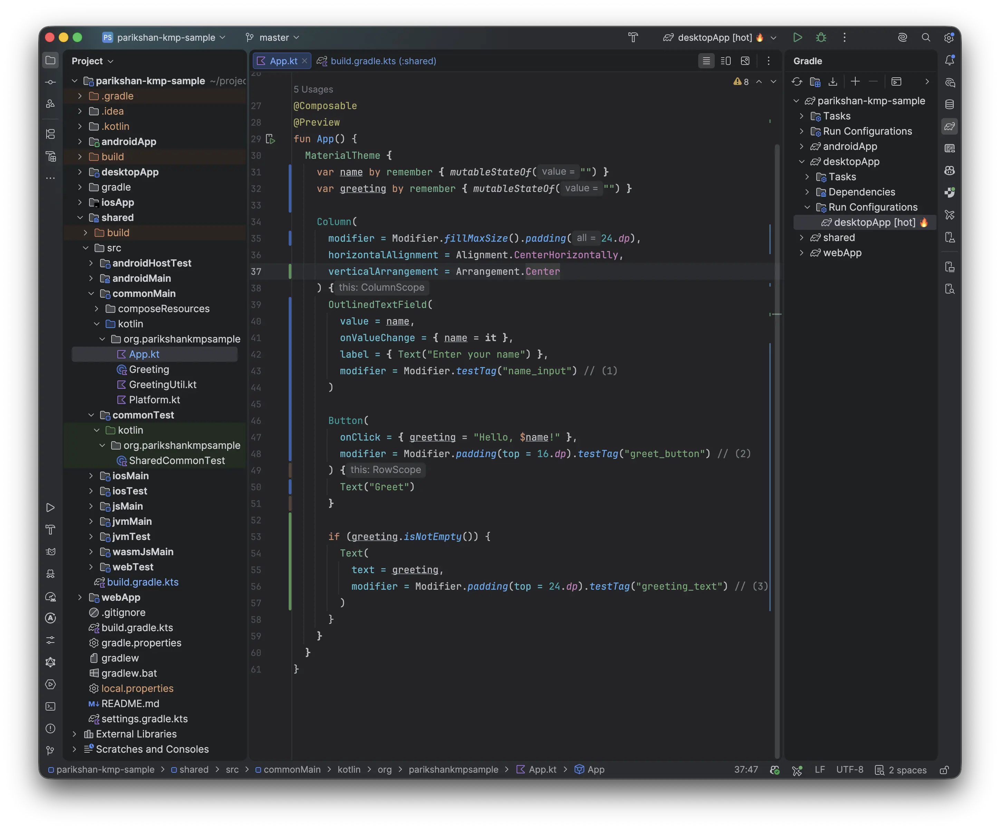
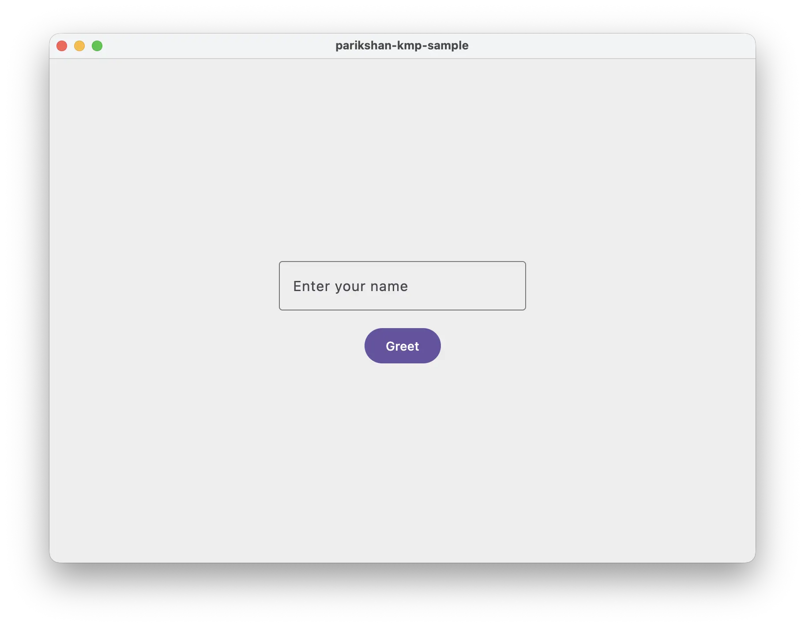
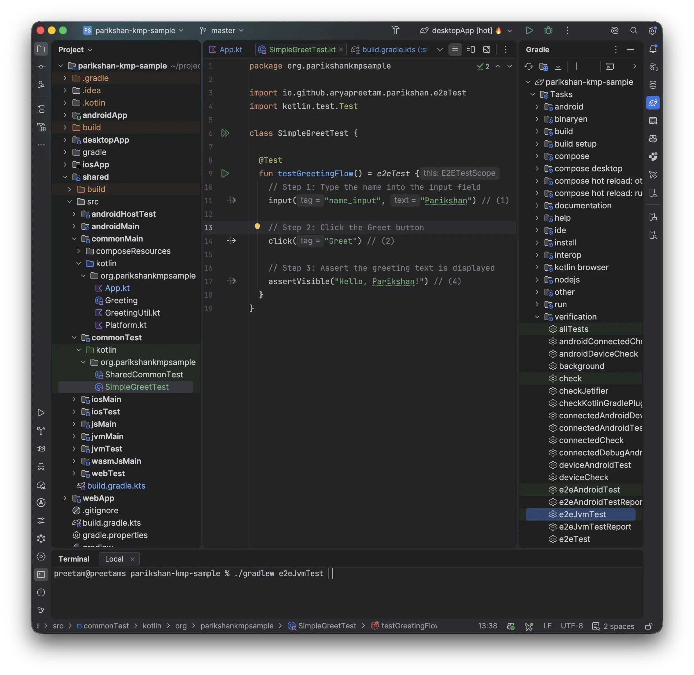
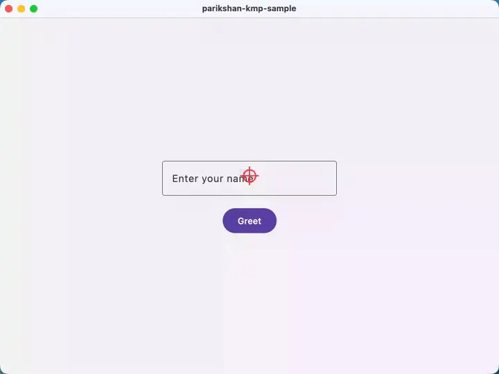

# Testing Forms & User Inputs

This guide covers how to test interactive Compose UI components, text inputs, keyboard entry, and explicit `Modifier.testTag` identifiers using Parikshan.

> **Sample Repository Branch:**  
> All code in this guide is available on the `feature/greeting-form` branch:  
> [github.com/aryapreetam/parikshan-kmp-sample/tree/feature/greeting-form](https://github.com/aryapreetam/parikshan-kmp-sample/tree/feature/greeting-form)

---

## Quick Setup: Switch or Clone Branch

If you followed [Your First Test](your-first-test.md), switch to the greeting form branch:

```bash
git checkout feature/greeting-form
```

Or clone the branch directly into a new directory:

```bash
git clone -b feature/greeting-form https://github.com/aryapreetam/parikshan-kmp-sample.git
```

---

## 1. Add Test Tags to Your UI Component

Open `shared/src/commonMain/kotlin/org/parikshankmpsample/App.kt` and define an interactive greeting screen. Use `Modifier.testTag(...)` to give interactive UI elements stable identifiers for automated testing:

```kotlin
package org.parikshankmpsample

import androidx.compose.foundation.layout.Arrangement
import androidx.compose.foundation.layout.Column
import androidx.compose.foundation.layout.fillMaxSize
import androidx.compose.foundation.layout.padding
import androidx.compose.material3.Button
import androidx.compose.material3.MaterialTheme
import androidx.compose.material3.OutlinedTextField
import androidx.compose.material3.Text
import androidx.compose.runtime.Composable
import androidx.compose.runtime.getValue
import androidx.compose.runtime.mutableStateOf
import androidx.compose.runtime.remember
import androidx.compose.runtime.setValue
import androidx.compose.ui.Alignment
import androidx.compose.ui.Modifier
import androidx.compose.ui.platform.testTag
import androidx.compose.ui.unit.dp
import org.jetbrains.compose.ui.tooling.preview.Preview

@Composable
@Preview
fun App() {
  MaterialTheme {
    var name by remember { mutableStateOf("") }
    var greeting by remember { mutableStateOf("") }

    Column(
      modifier = Modifier.fillMaxSize().padding(all = 24.dp),
      horizontalAlignment = Alignment.CenterHorizontally,
      verticalArrangement = Arrangement.Center
    ) {
      OutlinedTextField(
        value = name,
        onValueChange = { name = it },
        label = { Text("Enter your name") },
        modifier = Modifier.testTag("name_input") // (1)
      )

      Button(
        onClick = { greeting = "Hello, $name!" },
        modifier = Modifier.padding(top = 16.dp).testTag("greet_button") // (2)
      ) {
        Text("Greet")
      }

      if (greeting.isNotEmpty()) {
        Text(
          text = greeting,
          modifier = Modifier.padding(top = 24.dp).testTag("greeting_text") // (3)
        )
      }
    }
  }
}
```

1. `Modifier.testTag("name_input")`: Identifies the text field for typing input.
2. `Modifier.testTag("greet_button")`: Identifies the button for click interactions.
3. `Modifier.testTag("greeting_text")`: Identifies the result label for visibility assertions.

<div class="step-comparison" markdown="1">
<div class="step-images-row" markdown="1">
<div class="step-before" markdown="1">



</div>
<div class="step-arrow">&rarr;</div>
<div class="step-after" markdown="1">



</div>
</div>
<div class="step-captions-row">
<div class="caption-before"><em>1. Add test tags and layout in <code>App.kt</code></em></div>
<div class="caption-arrow"></div>
<div class="caption-after"><em>2. Greeting UI rendered with input and button centered</em></div>
</div>
</div>

---

## 2. Write the Form E2E Test

Create a new Kotlin test class inside `commonTest`:
`shared/src/commonTest/kotlin/org/parikshankmpsample/SimpleGreetTest.kt`

```kotlin
package org.parikshankmpsample

import io.github.aryapreetam.parikshan.e2eTest
import kotlin.test.Test

class SimpleGreetTest {

  @Test
  fun testGreetingFlow() = e2eTest {
    // Step 1: Type the name into the input field
    input("name_input", "Parikshan") // (1)

    // Step 2: Click the Greet button
    click("Greet") // (2)

    // Step 3: Assert the greeting text is displayed
    assertVisible("Hello, Parikshan!") // (3)
  }
}
```

1. **`input("name_input", ...)`**: Locates the text field by its `Modifier.testTag("name_input")` and simulates realistic character-by-character typing.
2. **`click("Greet")`**: Matches the button by its rendered text `"Greet"` and executes a tap.
3. **`assertVisible("Hello, Parikshan!")`**: Verifies that the dynamic greeting text is rendered in the UI hierarchy.

You can run your form test on Desktop JVM in either of the following ways:

* **From IDE:** Open the **Gradle** tool window on the right, navigate to `shared > Tasks > verification` (or `Tasks > verification`), and double-click **`e2eJvmTest`** (or right-click `SimpleGreetTest.kt` and select **Run 'SimpleGreetTest'**).
* **From Terminal:** Run:
  ```bash
  ./gradlew :shared:e2eJvmTest
  ```

<div class="step-comparison" markdown="1">
<div class="step-images-row" markdown="1">
<div class="step-before" markdown="1">



</div>
<div class="step-arrow">&rarr;</div>
<div class="step-after" markdown="1">



</div>
</div>
<div class="step-captions-row">
<div class="caption-before"><em>1. <code>SimpleGreetTest.kt</code> open in IDE</em></div>
<div class="caption-arrow"></div>
<div class="caption-after"><em>2. Desktop JVM test execution animation</em></div>
</div>
</div>

---

## 3. Run Across Targets

You can execute the exact same form test suite across all configured target platforms concurrently:

* **From IDE:** Open the **Gradle** tool window under `shared > Tasks > verification` (or `Tasks > verification`), double-click **`e2eTest`** (or right-click &rarr; **Run**).
* **From Terminal:** Run:
  ```bash
  ./gradlew :shared:e2eTest --targets=jvm,wasm,android
  ```

#### Visual Demo: Concurrent Multi-Target Test Execution

<video autoplay loop muted playsinline controls style="width: 100%; border-radius: 8px; border: 1px solid rgba(128, 128, 128, 0.2); margin: 1em 0;">
  <source src="../../assets/guides/first-test-kmp/test-run-all-targets.mp4" type="video/mp4" />
</video>

---

## 4. Selector Best Practices

Parikshan's selector engine evaluates target elements using a multi-tiered resolution pipeline:

1. **Explicit Test Tags:** Target using `Modifier.testTag("my_tag")` &rarr; `click("my_tag")` or `input("my_tag", ...)`.
2. **Text Content:** Target visible text directly &rarr; `click("Submit")` or `assertVisible("Welcome back")`.
3. **Content Descriptions:** Target accessibility labels &rarr; `click("Close dialog")`.

!!! tip
    Use visible text selectors for standard buttons and headers to keep your test code readable and close to user intent. Use `Modifier.testTag` for input fields or icon-only buttons that lack visible text labels.
