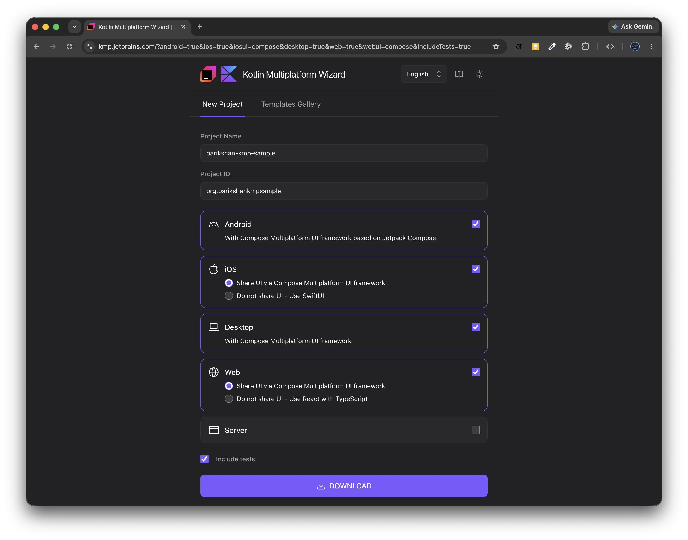
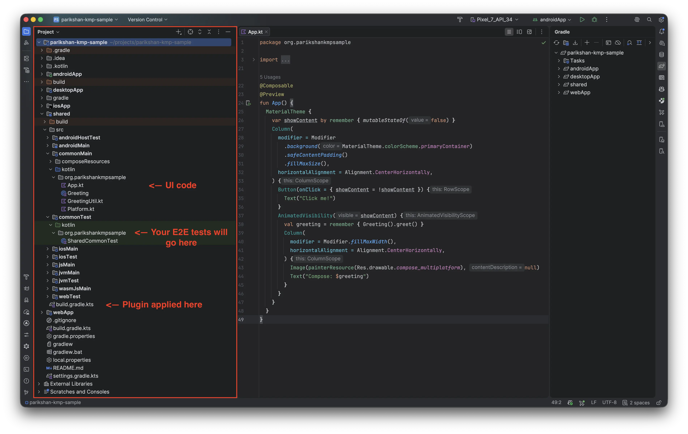
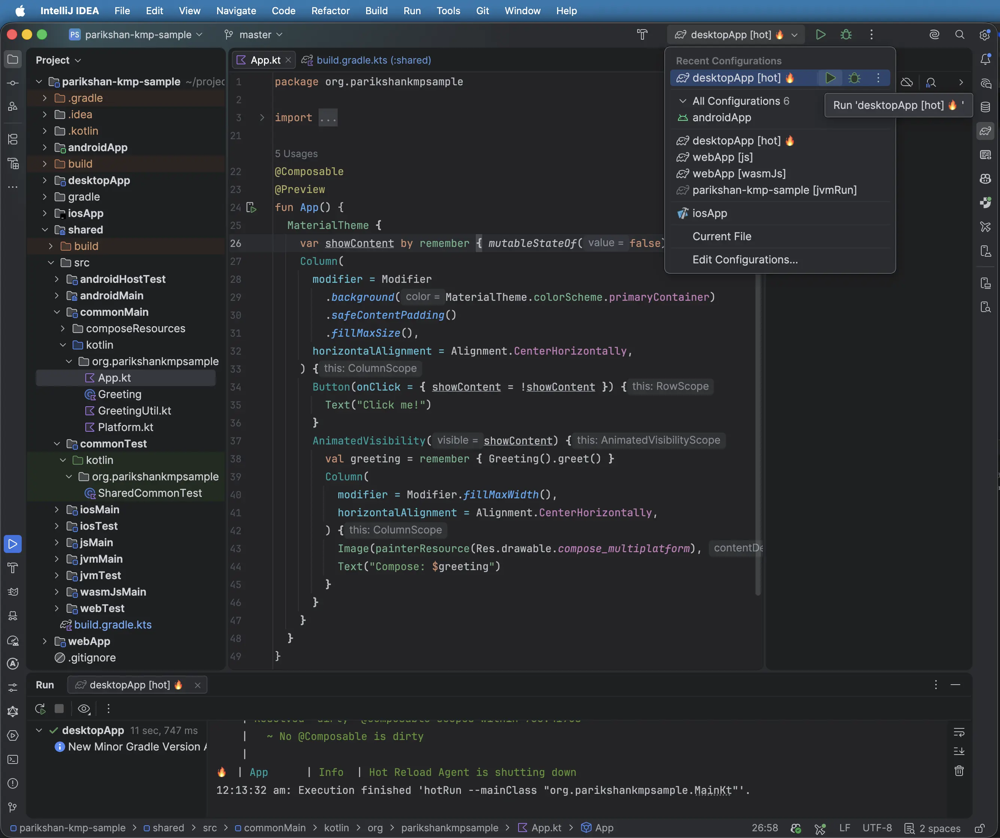
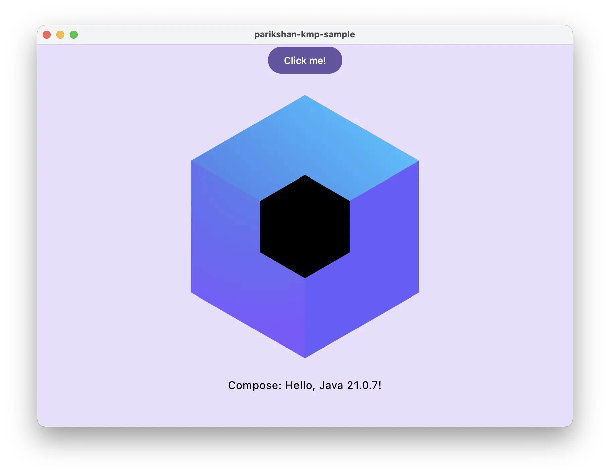
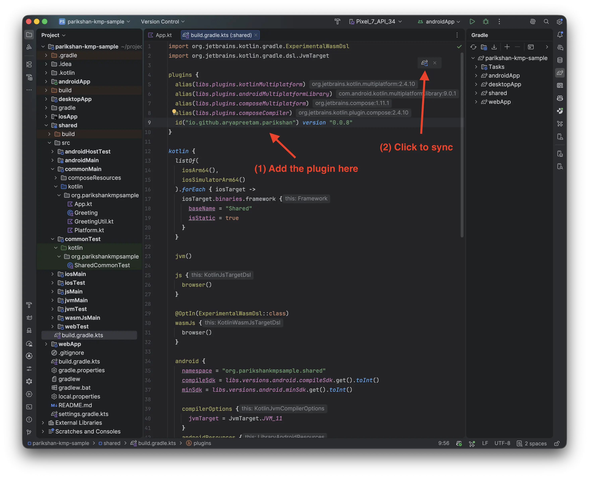
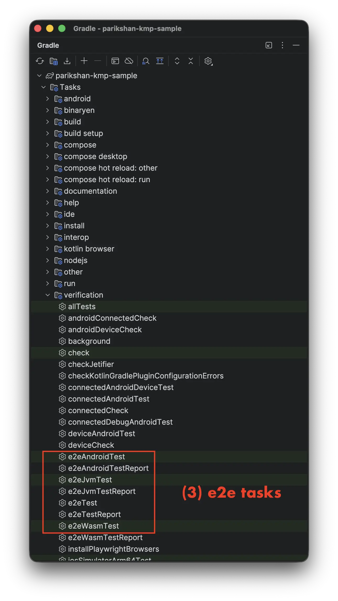
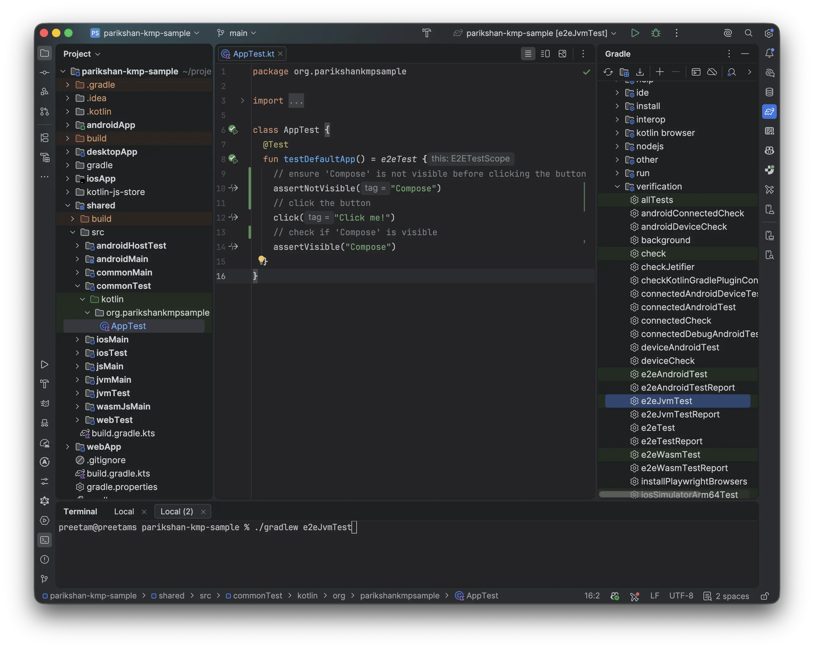

# Your First Test (Compose Multiplatform)

This step-by-step guide walks through creating and running your first multiplatform UI test from scratch using Parikshan in a Compose Multiplatform (KMP) application with **zero modifications to your UI code**.

> **Building a standalone Android app instead?** See [Your First Android Test](first-test-android.md).  
> **Prefer cloning a working project?** Clone the starter template: [github.com/aryapreetam/parikshan-kmp-sample](https://github.com/aryapreetam/parikshan-kmp-sample)

---

## 0. Prerequisites

Ensure your development environment meets the following requirements:

* **Java Development Kit (JDK):** Version 21 or newer (`java -version`).
* **IDE:** Android Studio (Ladybug 2024.2+ or newer) or IntelliJ IDEA (2024.2+).
* **Target Platforms:**
  * **Desktop (JVM):** Runs out of the box on macOS, Linux, and Windows. No emulators required.
  * **Web (WasmJs):** Node.js installed (Playwright browser binaries are downloaded automatically).
  * **Android:** Android Emulator or physical device connected via ADB (`adb devices`).
  * **iOS:** macOS host with Xcode installed (`xcrun simctl list`).

---

## 1. Create a Compose Multiplatform Project

Generate a new Compose Multiplatform project using the official [JetBrains Kotlin Multiplatform Wizard](https://kmp.jetbrains.com/).

### Wizard Configuration Settings

1. **Project Name:** `parikshan-kmp-sample`
2. **Project ID:** `org.parikshankmpsample`
3. **Targets:** Check **Android**, **Desktop**, **iOS**, and **Web (Wasm)**.
4. Click **Download** and unpack the generated archive.



Open the extracted folder in Android Studio or IntelliJ IDEA and wait for the initial Gradle sync to complete.

### Project Layout

The generated project has the following directory structure:

```text
parikshan-kmp-sample/
├── androidApp/
├── desktopApp/
├── gradle/
├── iosApp/
├── shared/
│   ├── src/
│   │   ├── androidMain/
│   │   ├── commonMain/
│   │   │   └── kotlin/org/parikshankmpsample/App.kt   <-- Default template UI
│   │   ├── commonTest/
│   │   │   └── kotlin/org/parikshankmpsample/         <-- Your E2E tests will go here
│   │   ├── iosMain/
│   │   ├── jvmMain/
│   │   └── wasmJsMain/
│   └── build.gradle.kts                               <-- Plugin applied here
├── webApp/
├── build.gradle.kts
├── gradlew
├── gradlew.bat
└── settings.gradle.kts
```



??? tip "Optional: Run the Baseline Desktop App First"

    Before modifying the code or applying the plugin, you can verify that your JDK and Compose toolchain work properly:

    * **From IDE:** Select `desktopApp` (or `jvm`) in the top run configurations dropdown and click the green **Run** (▶) button.
    * **From Terminal:** Run `./gradlew :desktopApp:run`

    <div class="step-comparison" markdown="1">
    <div class="step-images-row" markdown="1">
    <div class="step-before" markdown="1">

    

    </div>
    <div class="step-arrow">&rarr;</div>
    <div class="step-after" markdown="1">

    

    </div>
    </div>
    <div class="step-captions-row">
    <div class="caption-before"><em>1. Select <code>desktopApp</code> run configuration and click Run (▶)</em></div>
    <div class="caption-arrow"></div>
    <div class="caption-after"><em>2. Default Compose Multiplatform template window opens</em></div>
    </div>
    </div>

---

## 2. Apply the Parikshan Gradle Plugin

Open `shared/build.gradle.kts` and add the Parikshan Gradle plugin to your `plugins { ... }` block:

```kotlin
plugins {
  alias(libs.plugins.kotlinMultiplatform)
  alias(libs.plugins.composeMultiplatform)
  alias(libs.plugins.composeCompiler)
  id("io.github.aryapreetam.parikshan") version "0.0.9" // (1)
}
```

1. Applies the Parikshan Gradle Plugin, which automatically configures common test dependencies and target-specific test execution tasks (`e2eJvmTest`, `e2eWasmTest`, `e2eAndroidTest`, `e2eIosTest`, and `e2eTest`).

Click **Sync Now** in the top-right notification banner of your IDE to download and resolve dependencies.

Once synced, open the **Gradle** tool window on the right side of the IDE under `Tasks > verification` OR `shared > Tasks > verification` to see all Parikshan `e2e*` tasks automatically registered:

<div class="step-comparison" markdown="1">
<div class="step-images-row" markdown="1">
<div class="step-before" markdown="1">



</div>
<div class="step-arrow">&rarr;</div>
<div class="step-after" markdown="1">



</div>
</div>
<div class="step-captions-row">
<div class="caption-before"><em>1. Add plugin to <code>shared/build.gradle.kts</code> and click Sync</em></div>
<div class="caption-arrow"></div>
<div class="caption-after"><em>2. <code>e2e*</code> tasks registered under <code>verification</code></em></div>
</div>
</div>

---

## 3. Write Your First E2E Test

With Parikshan, you do not need to modify your existing UI code or add custom test tags to get started. You can test the default template UI directly by matching button text and accessibility semantics.

Create a new Kotlin test class inside `commonTest`:
`shared/src/commonTest/kotlin/org/parikshankmpsample/AppTest.kt`

```kotlin
package org.parikshankmpsample

import io.github.aryapreetam.parikshan.e2eTest
import kotlin.test.Test

class AppTest {

  @Test
  fun testDefaultApp() = e2eTest {
    // ensure 'Compose' is not visible before clicking the button
    assertNotVisible("Compose")  // (1)
    // click the button
    click("Click me!")           // (2)
    // check if 'Compose' is visible
    assertVisible("Compose")     // (3)
  }
}
```

1. **`assertNotVisible("Compose")`**: Asserts that the dynamic greeting text containing `"Compose"` is not rendered in the UI tree before the button click.
2. **`click("Click me!")`**: Finds the Composable button containing the text `"Click me!"` and simulates a click.
3. **`assertVisible("Compose")`**: Asserts that the dynamic greeting text containing `"Compose"` is rendered in the UI tree.

!!! caution "Do Not Run Tests via IDE Gutter Icons"
    Running tests directly via the green gutter play icon (▶) next to `@Test` or class declarations in IntelliJ IDEA / Android Studio is not currently supported for Parikshan host-driven tests. Gutter icon execution will be enabled once the dedicated Parikshan IDE plugin is released.

    

    **Recommended execution methods:**
    
    * **From Terminal (Recommended):** Run `./gradlew :shared:e2eJvmTest` or `./gradlew :shared:e2eTest` (offers full CLI options, filters, and device flags).
    * **From Gradle Tool Window:** Open the **Gradle** tool window on the right, navigate to `shared > Tasks > verification`, and double-click **`e2eJvmTest`**.

You can run your test on Desktop JVM in either of the following ways:

* **From Terminal (Recommended):** Run:
  ```bash
  ./gradlew :shared:e2eJvmTest
  ```
* **From Gradle Tool Window:** Open the **Gradle** tool window on the right, navigate to `shared > Tasks > verification` (or `Tasks > verification`), and double-click **`e2eJvmTest`**.

<div class="step-comparison" markdown="1">
<div class="step-images-row" markdown="1">
<div class="step-before" markdown="1">



</div>
<div class="step-arrow">&rarr;</div>
<div class="step-after">
  
</div>
</div>
<div class="step-captions-row">
<div class="caption-before"><em>1. <code>AppTest.kt</code> open in IDE</em></div>
<div class="caption-arrow"></div>
<div class="caption-after"><em>2. Desktop JVM test execution</em></div>
</div>
</div>

<video autoplay loop muted playsinline controls style="width: 100%; border-radius: 8px; border: 1px solid rgba(128, 128, 128, 0.2); margin: 1em 0;">
  <source src="../../assets/guides/first-test-kmp/e2e-test-first-sample.mp4" type="video/mp4" />
</video>

---

## 4. Run Across Targets

You can execute the exact same test suite across all configured target platforms concurrently:

* **From IDE:** Open the **Gradle** tool window under `shared > Tasks > verification` (or `Tasks > verification`), double-click **`e2eTest`** (or right-click &rarr; **Run**).
* **From Terminal:** Run:
  ```bash
  ./gradlew :shared:e2eTest
  ```

<video autoplay loop muted playsinline controls style="width: 100%; border-radius: 8px; border: 1px solid rgba(128, 128, 128, 0.2); margin: 1em 0;">
  <source src="../../assets/guides/first-test-kmp/first-test-all.mp4" type="video/mp4" />
</video>

!!! tip "Terminal Customization"
    We recommend running tests from the terminal as it provides powerful CLI customization options:

    * **Filter specific test classes or methods:**
      ```bash
      ./gradlew :shared:e2eTest --tests=org.parikshankmpsample.AppTest.testDefaultApp
      ```
    * **Select specific target platforms:**
      ```bash
      ./gradlew :shared:e2eTest --targets=jvm,wasm,android
      ```
    * **Target individual platforms directly:**
      ```bash
      ./gradlew :shared:e2eWasmTest     # Web Wasm (Playwright)
      ./gradlew :shared:e2eAndroidTest  # Android Emulator / Device
      ./gradlew :shared:e2eIosTest      # iOS Simulator (macOS host)
      ```

---

## 5. Next Steps: Testing Forms & User Inputs

Now that you have your first test running, learn how to handle text inputs, keyboard events, and custom `Modifier.testTag` identifiers when building forms:

&rarr; Continue to **[Testing Forms & User Inputs](forms-and-inputs.md)**.
