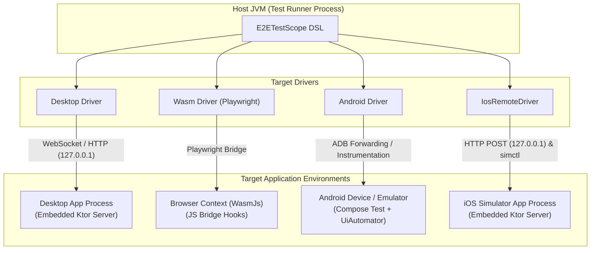

# Architecture & Security

This document outlines Parikshan's internal communication model, production build isolation, source instrumentation mechanism, driver architecture, selector engine, and platform boundaries for technical evaluators and security reviewers.

---

## Production Build Isolation

Parikshan is designed to ensure zero test code, server binaries, or test instrumentation hooks leak into production application artifacts.

### Dependency Scoping

Parikshan plugin tasks bind test infrastructure strictly to test compilation configurations (`testImplementation`, `androidTestImplementation`, or dedicated E2E source sets).

```
Production Build (Release APK / iOS Archive / Wasm Bundle)
└── Your Application Code
    └── Compose Multiplatform Runtime
    (No Parikshan dependencies, no embedded server, no test hooks)

E2E Test Execution Build
├── Your Application Code
├── parikshan-server (Embedded inside application process for Desktop/iOS)
└── parikshan-client (Runs inside host JVM test runner process)
```

* **Desktop & iOS:** The application binary compiled during E2E test tasks includes `parikshan-server`. Production releases built via standard `./gradlew assembleRelease` or Xcode release schemes do not compile or package `parikshan-server` classes or manifest entries.
* **WasmJs:** Web builds communicate via Playwright browser context automation. Production Wasm JS artifacts contain no embedded test listeners or JS bridge hooks.

---

## Zero-Pollution Source Instrumentation

Android and JVM/Desktop targets support dynamic reflection and test instrumentation hooks at runtime. However, iOS (`ComposeUIViewController`) and WasmJs (`ComposeViewport` / `main()`) do not support dynamic runtime reflection without modifying application entry points.

To prevent developers from adding test server imports to production source code (`src/iosMain` or `src/wasmJsMain`), Parikshan uses build-time source instrumentation tasks:

1. **Isolation Tasks:** When running `e2eIosTest` or `e2eWasmTest`, Gradle tasks (`prepareParikshanIosBootSource` and `prepareParikshanWasmBootSource`) run prior to Kotlin compilation.
2. **Build Directory Copying:** Source files from `src/iosMain/kotlin` or `src/wasmJsMain/kotlin` are copied to isolated build directories (`build/parikshan/generated-ios-main` or `build/parikshan/generated-wasm-main`).
3. **AST / Source Wrapping:** The instrumented files swap `ComposeUIViewController` with `ParikshanUIViewController` (or inject `initializeParikshanWasm()` inside `main()`).
4. **Source Directory Replacement:** The Gradle task excludes the physical source directory from the test compilation task and replaces it with the instrumented build directory.

Your original source code on disk remains untouched, and production builds bypass these generated source directories entirely.

---

## Transport & Network Security

When running E2E tests on Desktop or iOS, `parikshan-server` runs an embedded HTTP and WebSocket listener within the application process.

### Security Controls

* **Localhost Binding:** Embedded Ktor servers bind exclusively to loopback (`127.0.0.1`). External network interfaces (`0.0.0.0`) are not exposed.
* **Dynamic Port Resolution:** Port selection uses OS-assigned available ports with automatic conflict fallback to prevent collisions in parallel CI environments.
* **Session Security Tokens:** Each test run generates a single-use UUID security token passed to the test application at launch via environment variables or startup arguments (`PARIKSHAN_TOKEN=<uuid>`). Requests sent to `parikshan-server` without a matching `X-Parikshan-Token` header return HTTP 403 Forbidden.
* **Android ADB Socket Forwarding:** On Android targets, test communication uses ADB socket forwarding (`adb forward tcp:<host_port> tcp:<device_port>`). The device-side server remains bound to loopback.

---

## Cross-Platform Driver Architecture

Parikshan uses target-specific drivers managed by a unified `TestDriver` interface in the host JVM.



### Platform Summary

| Platform | Execution Context | Transport Protocol | Automation Engine |
| :--- | :--- | :--- | :--- |
| **Desktop (JVM)** | Host JVM → App Process | WebSocket / HTTP (`127.0.0.1`) | Compose Semantics Tree |
| **WasmJs** | Host JVM → Browser | Playwright JS Bridge | Playwright + Compose Web Semantics |
| **Android** | Host JVM → Test APK on Device | ADB Forwarding / Instrumentation | Jetpack Compose Testing + UiAutomator |
| **iOS** | Host JVM → iOS Simulator | HTTP POST (`127.0.0.1`) + `xcrun simctl` | Embedded Server + Compose Semantics |

### iOS Automation & Process Management Details

* **Communication:** `IosRemoteDriver` sends HTTP POST JSON requests to the embedded Ktor server on `http://127.0.0.1:9878`.
* **Process Lifecycle:** App relaunching executes `xcrun simctl terminate` and `xcrun simctl launch` with `SIMCTL_CHILD_PARIKSHAN_TOKEN` forwarded.
* **Video Recording:** Video capture uses `xcrun simctl io <udid> recordVideo` running directly on the host machine. Completed files are post-processed with `ffmpeg` (`-movflags faststart`) to ensure proper web streaming headers.

---

## Build Architecture & Target Flexibility

Parikshan's Gradle plugin evaluates target platforms defined in your project's `kotlin { ... }` block conditionally.

### Target-Specific Tasks
If your project configures only Android and iOS (`androidTarget()` and `iosSimulatorArm64()`), Parikshan registers only target-relevant tasks (`e2eAndroidTest` and `e2eIosTest`). Unconfigured targets (such as WasmJs or Desktop) are bypassed without requiring dummy code or throwing build errors.

### Unified Test Runner (`e2eTest`)
The unified `e2eTest` task automatically detects all active targets and executes tests across them:

```bash
# Run tests across all configured targets
./gradlew e2eTest

# Run tests for specific targets only using the --targets flag
./gradlew e2eTest --targets=android
./gradlew e2eTest --targets=ios
./gradlew e2eTest --targets=android,ios
```

---

## Dependency Conflict Resolution

When Parikshan adds required test libraries (`ktor-client-core`, `kotlinx-coroutines-core`, `androidx.compose.ui:ui-test-junit4-android`) to test configurations, Gradle's standard dependency resolution engine manages version alignment.

If your project already includes these dependencies in `testImplementation` or `androidTestImplementation`, Gradle resolves version constraints according to standard conflict resolution rules (selecting the highest compatible version or respecting explicit project constraints). Parikshan does not force version locks or use unshaded fat JARs.

---

## Selector Engine & Frame Settlement

### Node Resolution Pipeline

Tests target UI elements using `Selector.Auto`, `Selector.Tag`, or `Selector.Text`. When `resolveNode()` queries the Compose Semantics Tree, matching follows a 4-stage precedence pipeline:

1. **Exact Tag Match:** Checks `Modifier.testTag("tag_name")`.
2. **Exact Text Match:** Matches visible node text or content description.
3. **Substring / Prefix Fallback:** Matches text starting with (`startsWith`) or containing (`contains`) the query string.
4. **Bounding Area Tie-Breaker:** When multiple visible nodes match identical text, the engine calculates bounding box area (`width * height`) and selects the smallest node (preferring child UI components over parent card containers).

### Deterministic Synchronization

Parikshan avoids arbitrary `Thread.sleep()` calls. DSL actions (`click`, `input`, `assertVisible`) dynamically poll the UI semantics tree until target nodes settle or the configured timeout (`defaultWaitTimeoutMs = 10000ms`) expires.

---

## Scope & Known Boundaries

* **Compose Semantics Focus:** Parikshan targets elements defined within the Compose Multiplatform Semantics Tree (nodes annotated with `Modifier.testTag()`, text content, or content descriptions).
* **Native Embedded Views:** Non-Compose native views embedded inside Compose layouts (such as iOS `UIKitView` / `WKWebView` or Android `AndroidView`) appear as opaque container nodes in the Compose semantics tree. Parikshan can verify the existence of the container node, but cannot inspect or click elements inside an embedded native webview.
* **WasmJs System Dialogs:** File pickers and OS permission popups in browser environments rely on Playwright browser context mocks rather than native OS prompts.
* **iOS Simulator Host Requirement:** iOS E2E test execution requires a macOS host with Xcode and iOS Simulator components installed.
* **Hardware Sensor Mocks:** Physical biometrics and camera feeds are not intercepted by Compose semantics and must be mocked at the application layer.
