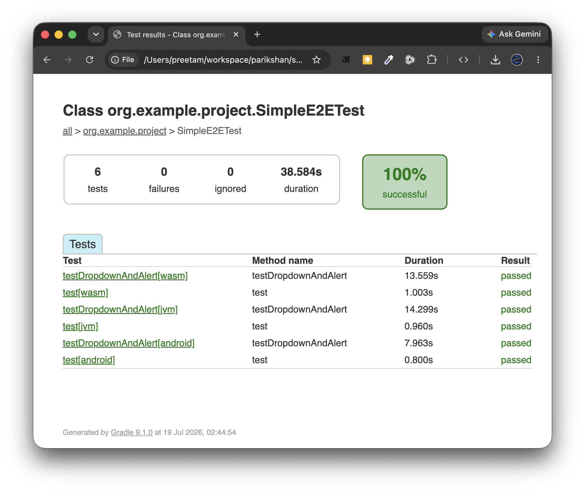
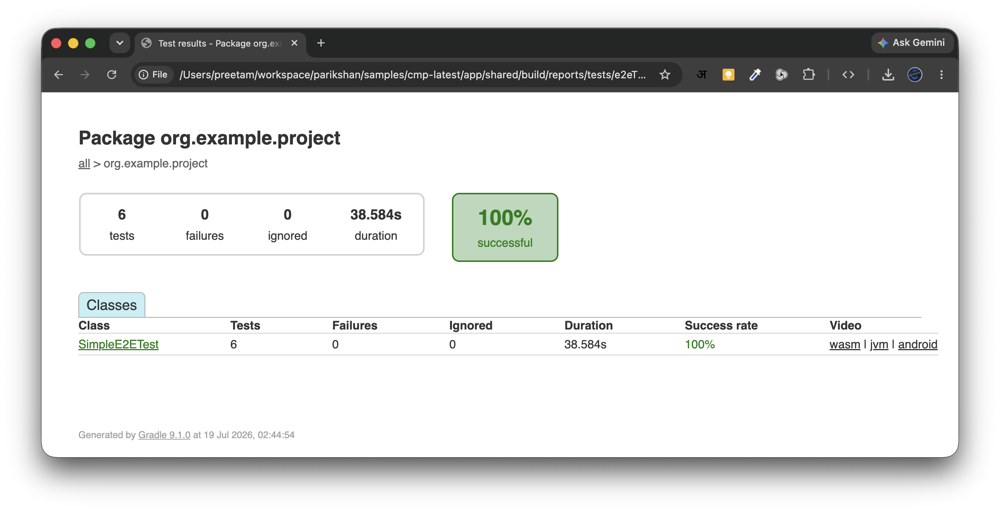

# Test Reports & Video Recording

Parikshan automatically aggregates test execution outputs into unified HTML reports and JUnit XML logs across all targets.

---

## Report Directory & Output Structure

When executing `./gradlew e2eTest` or target-specific tasks (`e2eDesktopTest`, `e2eWasmTest`, `e2eAndroidTest`, `e2eIosTest`), reports are output to:

```text
<module>/build/reports/tests/e2eTest/index.html
```

Terminal log output displays report URLs upon completion:

```text
========================================
      Parikshan E2E Test Results        
========================================
[DESKTOP] SUCCESS - All 43 tests passed.
[WASM]    SUCCESS - All 43 tests passed.
[ANDROID] SUCCESS - All 43 tests passed.
[IOS]     SUCCESS - All 43 tests passed.
========================================

Parikshan: Unified E2E HTML Report generated at file:///Users/user/workspace/app/build/reports/tests/e2eTest/index.html
```

---

## Unified HTML Report View

The generated HTML report includes execution durations, target breakdowns, failure stack traces, and embedded media.



### Failure Screenshots & Video Embedding

When video recording is enabled, the report embeds MP4 video links directly alongside failure screenshots for rapid triage.


